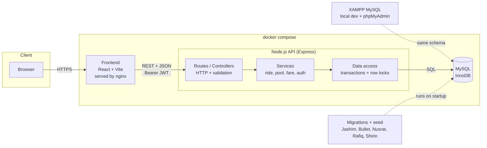
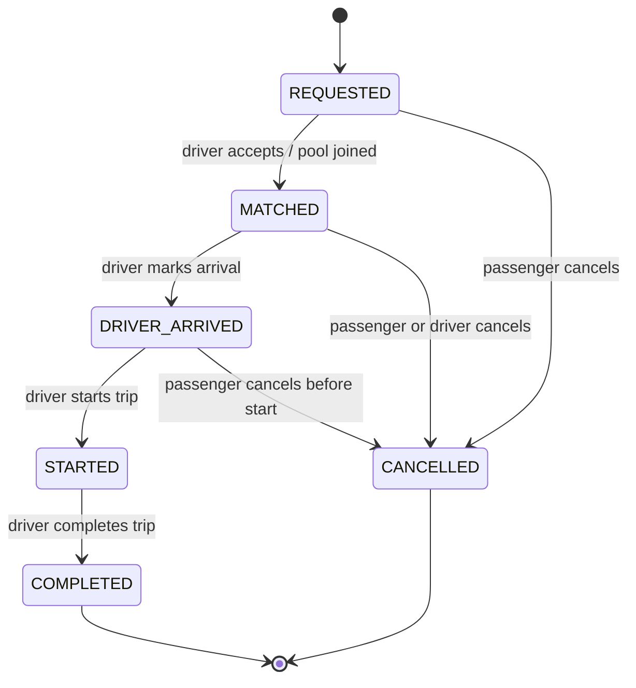
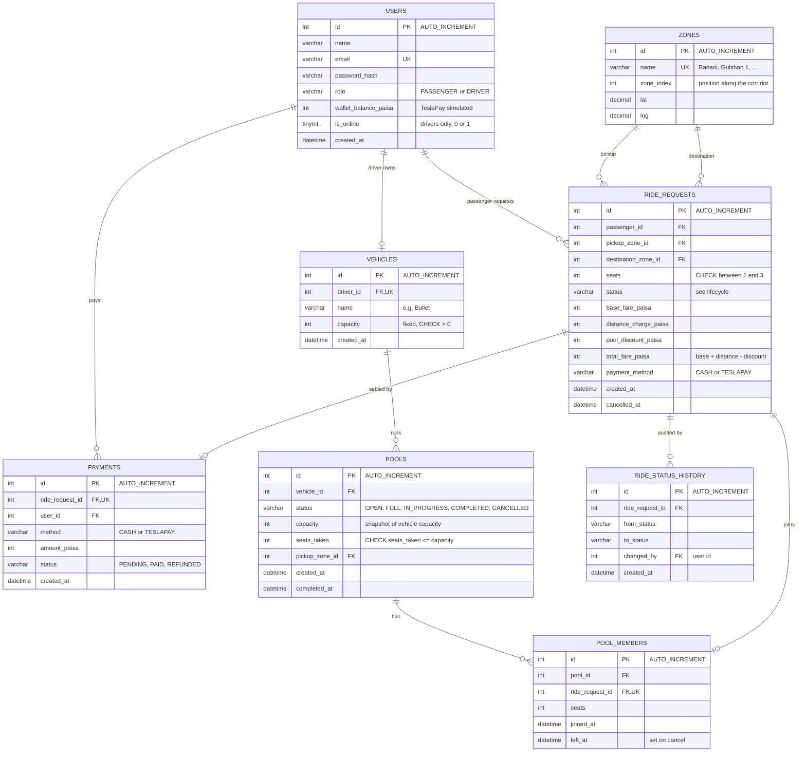

# Dhaka Tesla Pool: Architecture and ERD

Database: MySQL (XAMPP for local development, MySQL container in `docker compose` for submission).

## 1. System architecture

## 2. Ride lifecycle

## 3. ERD

