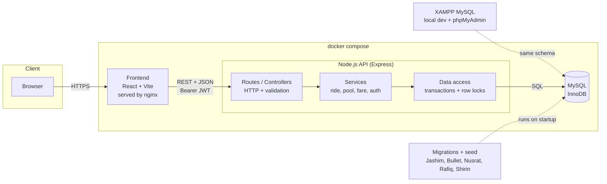
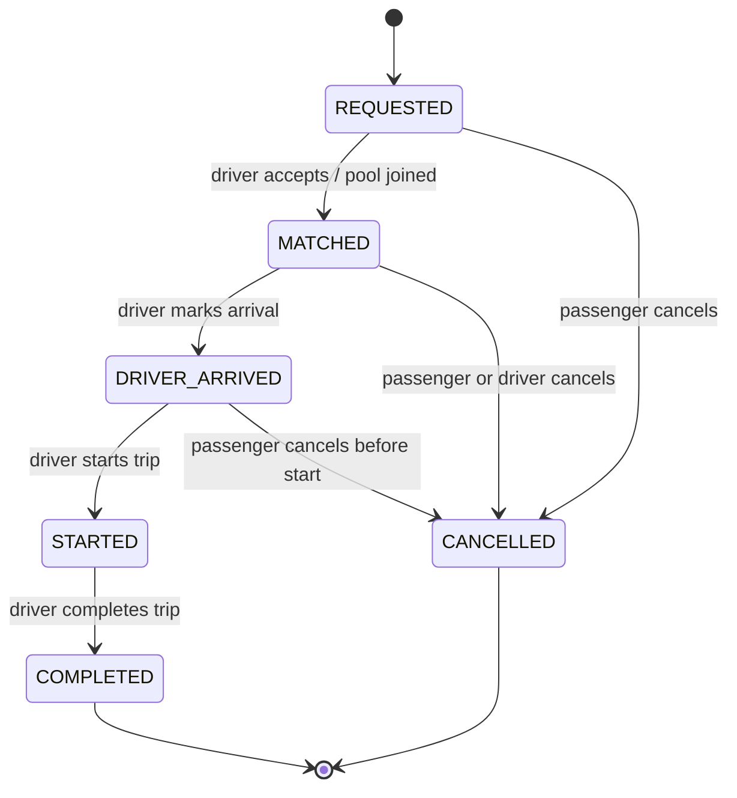
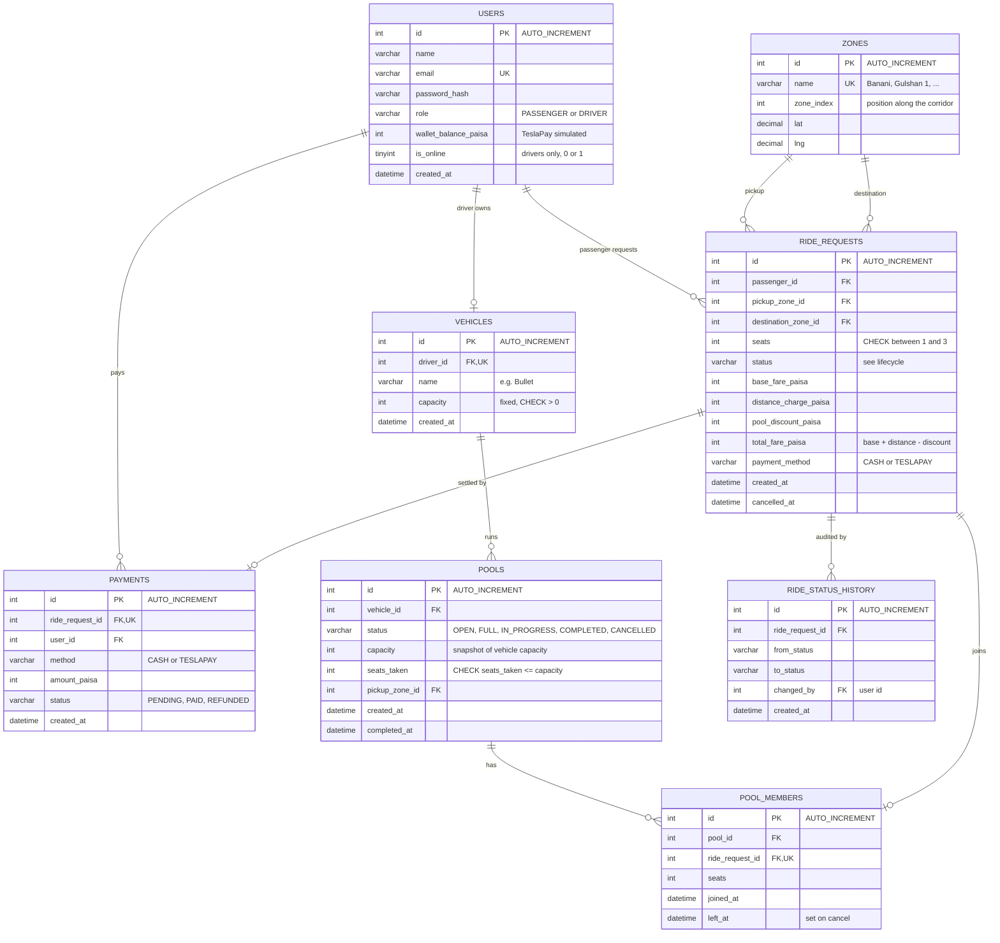
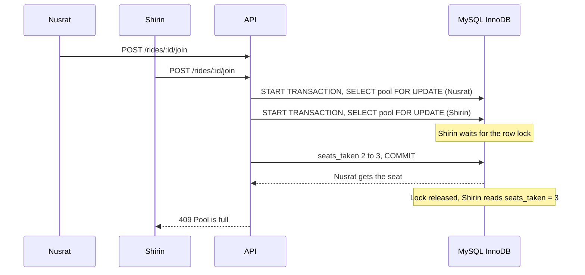

# Dhaka Tesla Pool: Architecture and ERD

This document is the design-first step from the PRD (Section 9). If the implementation changes, update it here.

**Database:** MySQL (MariaDB via XAMPP during local development, a MySQL container in `docker compose` for submission). All tables use the **InnoDB** engine, which is required for transactions and row locks.

## 1. System architecture

**Why this shape**
- One API and one database. No queues, cache or microservices, because the MVP has no load that needs them.
- Business rules (matching, fare, capacity, state transitions) live in the **Services** layer, not in routes or the frontend.
- Capacity safety is enforced twice: by a row lock in the service and by a `CHECK` constraint in the database.
- XAMPP is for fast local development. The submitted version must still run with `docker compose up`, so the same migrations run against a MySQL container.

## 2. Ride lifecycle

Rules:
- Any transition not shown above is rejected with `409 Conflict`.
- Once a ride is `STARTED`, the passenger can no longer cancel.
- Every transition writes one row to `ride_status_history`.

## 3. ERD

## 4. Table notes (be ready to explain each)

| Table | Purpose | Key decision |
|-------|---------|--------------|
| `users` | Passengers and drivers in one table, split by `role`. | One login system. Wallet balance lives here because the wallet is simulated. |
| `vehicles` | A Tesla and its fixed seat capacity. | `driver_id` is unique: one driver owns one Tesla in the MVP. |
| `zones` | Predefined Dhaka areas with a `zone_index`. | Replaces real routing. The matching rule and distance charge both use `zone_index`. |
| `pools` | One shared trip of one Tesla. | `seats_taken` with `CHECK (seats_taken <= capacity)` is the last line of defence against overbooking. |
| `pool_members` | Which ride request belongs to which pool. | `ride_request_id` is unique, so a request can be in only one pool. `left_at` keeps history when someone cancels. |
| `ride_requests` | One passenger's request and their own fare. | Each passenger has an individual fare breakdown. Passengers only read rows where `passenger_id` is their own id. |
| `ride_status_history` | Append-only audit log of every state change. | Lets us explain exactly what happened after a ride ends. |
| `payments` | Cash or TeslaPay record per ride. | Separate from `ride_requests` so payment state can change without touching ride state. |

**MySQL-specific notes**
- Use `INT AUTO_INCREMENT` ids: simpler to read in phpMyAdmin than UUIDs.
- Use `DATETIME` (store UTC) for timestamps and `TINYINT(1)` for booleans.
- `CHECK` constraints are enforced in MariaDB 10.2+ and MySQL 8.0.16+. Older versions silently ignore them, so verify your XAMPP version.
- Status columns can be `VARCHAR` with a `CHECK (status IN (...))`, or `ENUM`. `VARCHAR` + `CHECK` is easier to change later.

## 5. Concurrency: Bullet has 1 seat left

Nusrat and Shirin both claim the last seat at the same instant.

**Now (MVP):** an InnoDB transaction with `SELECT ... FOR UPDATE` on the pool row, plus the `CHECK` constraint as a safety net. MyISAM would not work here because it has no transactions or row locks.

**At larger scale:** move to optimistic locking with a version column and retries, partition matching by geo-cell so contention is spread out, and add idempotency keys so retried requests never double-book.

## 6. Assumptions baked into this design

- One driver owns one Tesla; capacity is 3 seats.
- A passenger can book 1 to 3 seats in one request.
- Money is stored as **integer paisa** to avoid floating-point rounding errors.
- Geography is a predefined zone list; no map API or real routing.
- Payment is cash or simulated TeslaPay wallet; no real gateway.
- Local development uses XAMPP MySQL; the submitted setup uses a MySQL container.
